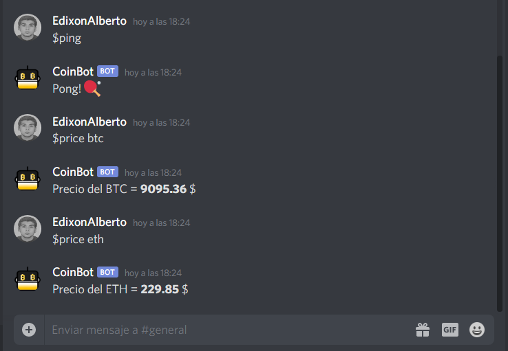

# <p style="display: inline; font-size: 29px;"> CoinBot</p>

[](https://linkedin.com/in/edixonalberto)
[](./LICENSE.md)


Discord bot to manager cryptocurrencies in binance exchange.

### Get Started

Crete file `development.env` in folder: `/.env` and add el environment: **DISCORD_TOKEN**.

```sh
cp .env/template.env .env/development.env
```

Install dependencies and start.

```sh
yarn install

yarn run start:dev # to develop

yarn run start:prod # to production
```

The command and `yarn start` is reserved to heroku.

The bot command list in discord can be found [HERE](./src/enumerations.ts).

### Screenshots


